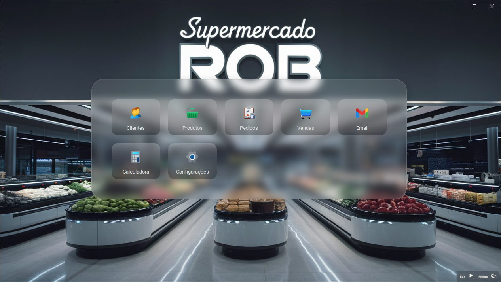
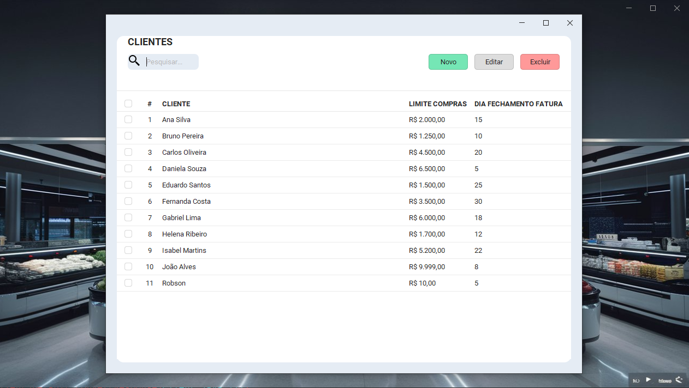
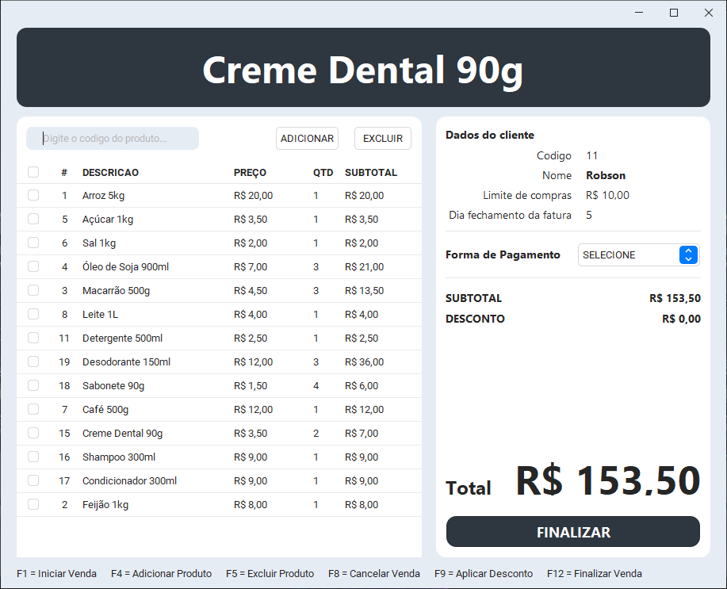
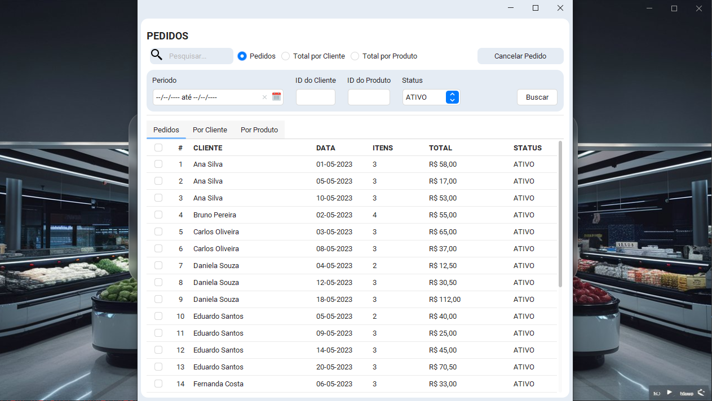

# 🛍️ Vendas App

<p align="center">
  
  
</p>
<p align="center">
  
  
</p>

## 📋 Sobre o Projeto

**Vendas App** é uma aplicação de gerenciamento de vendas full stack desenvolvida para praticar e consolidar meus conhecimentos adquiridos sobre Java até a data atual. A aplicação possui um backend robusto utilizando **Spring Boot** e um frontend desenvolvido com **Java Swing**.

### 🎯 Funcionalidades

- **👥 Gerenciamento de Clientes:** Adicione, edite e remova clientes.
- **📦 Gerenciamento de Produtos:** Adicione, edite e remova produtos.
- **📝 Gerenciamento de Pedidos:** Crie, visualize e gerencie pedidos.
- **💰 PDV (Ponto de Vendas):** Interface para realização de vendas.

### 🛠️ Tecnologias Utilizadas

#### Backend (API Spring Boot)

- **🛠️ POO:** Programação Orientada a Objetos.
- **🗂️ JPA:** Java Persistence API para mapeamento objeto-relacional.
- **🔍 JdbcClient:** Para consultas diretas ao banco de dados.
- **✅ Bean Validation:** Validação de dados.
- **⚠️ ProblemDetail:** Tratamento de erros padronizado.
- **🌐 API Rest:** Criação de APIs RESTful.
- **🔣 Generics:** Uso de generics para tipos parametrizados.
- **🐘 PostgreSQL:** Banco de dados relacional integrado em um container Docker.
- **✨ Lombok:** Redução de código boilerplate.
- **🔄 MapStruct:** Mapeamento automático de objetos.
- **🧪 Testes:** 
  - **🧪 JUnit 5:** Testes unitários nas classes de serviço.
  - **🔍 Mockito:** Mocking para testes unitários.
  - **✅ AssertJ:** Assertivas fluentes.
  - **🔧 Testes de integração:** Para as classes de controller.
  - **📊 Jacoco:** Ferramenta para cobertura de testes.

#### Deploy

- **🐳 Docker:** Containerização do backend e banco de dados.
  - **📜 Dockerfile:** Configuração do container.
  - **📦 Docker Compose:** Orquestração de múltiplos containers.

#### Frontend (Java Swing com Java 17)

- **🖥️ Java Swing:** Interface gráfica.
- **🌐 OpenFeign:** Cliente HTTP declarativo.
- **🔄 MapStruct:** Mapeamento automático de objetos.
- **📐 MigLayout:** Layout manager flexível e poderoso.
- **🎨 FlatLaf:** Look and feel moderno para Swing.
- **📚 Bibliotecas adicionais:** Diversas bibliotecas úteis do @DJ-Raven.

## 🚀 Instalação e Execução

### Pré-requisitos

- **🐳 Docker:** Certifique-se de ter o Docker instalado e em execução.
- **☕ Java 17:** Necessário para executar a aplicação Swing.

### Passos para Executar

#### Backend

1. Dentro de uma pasta de sua preferencia crie um arquivo chamado `docker-compose.yml`
2. Copie o codigo abaixo e cole dentro do arquivo `docker-compose.yml` criado:
    ```yaml
    services:
      app:
        image: imrob/app-vendas-api
        container_name: app-vendas
        ports:
          - "8080:8080"
        environment:
          DB_URL: jdbc:postgresql://db:5432/db_vendas
          DB_USERNAME: postgres
          DB_PASSWORD: teste@VR
        depends_on:
          - db
      db:
        image: postgres:alpine
        container_name: db
        ports:
          - "5432:5432"
        environment:
          POSTGRES_DB: db_vendas
          POSTGRES_USER: postgres
          POSTGRES_PASSWORD: teste@VR
        volumes:
          - postgres_data:/var/lib/postgresql/data
    
    volumes:
      postgres_data:
    ```

2. Agora abra o terminal na pasta em que se encontra o arquivo criado e execute os containers docker:
    ```sh
    docker-compose up
    ```

   O backend estará disponível na porta `8080`.

#### Frontend

1. Baixe a última versão da aplicação Vendas App na seção de releases: https://github.com/imrob-s/app-vendas/releases/latest
2. Execute o arquivo JAR da aplicação. (Antes verifique de estar usando a versão do java 17 ou posterior)
    ```sh
    java -version
    java -jar AppVendas.jar
    ```

### Configuração do Banco de Dados

A aplicação utiliza PostgreSQL como banco de dados, integrado em um container Docker e já configurado com o backend. Não é necessário ajuste adicional nas configurações de conexão.

## 🤝 Contribuições

Contribuições são bem-vindas! Sinta-se à vontade para abrir issues e pull requests para melhorias ou correções.

## 📜 Licença

Este projeto está licenciado sob a licença MIT. Veja o arquivo [LICENSE](LICENSE) para mais detalhes.

## 📧 Contato

Para dúvidas ou suporte, entre em contato pelo email: [orobsilva@gmail.com](mailto:orobsilva@gmail.com).
